# FormBook Analysis
<br>

File Type: **.NET Executable**


Sha-256: **00BF4F4B097DBA66153C48984E6C838F2A1785CC0328652F2017338C9D901CC7**

<br><br>

## Static Analysis:
<br>
This .net executable contains a lot of code for a game named "OneGame".


<br><br>

In a function called "SetCredentials" however we can see an object named "XXXWWW" being initialized.


<br><br>

Lets step inside this class:

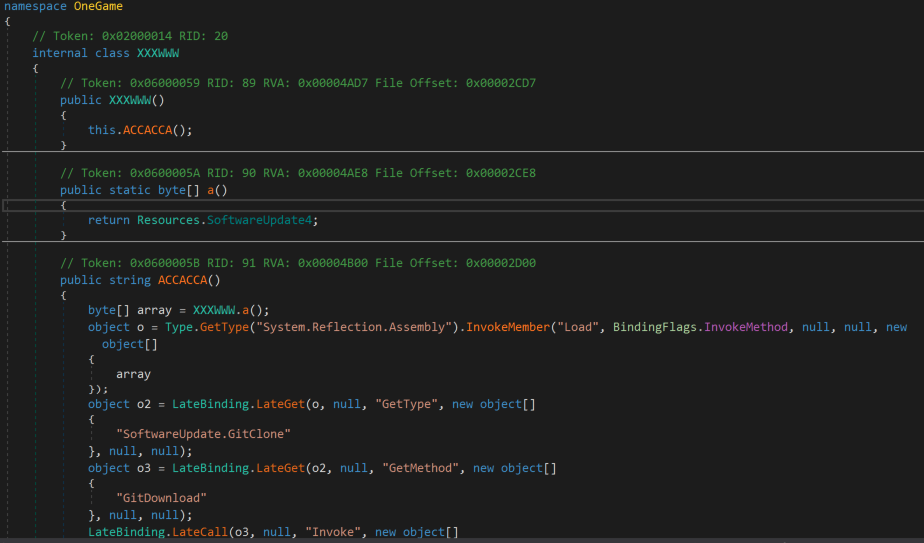

<br><br>

The first thing this code does is return a byte array using  a call to "Resources.SoftwareUpdate4".


Inside "Resources.SoftwareUpdate4":


<br><br>

Here we are using an object called resource manager(this is a resource manager pointing to "OneGame.Properties.Resources". It is using this to load something from .net built in resources. 


We can look into this using CFF Explorer (.net resources not available through PE Studio)


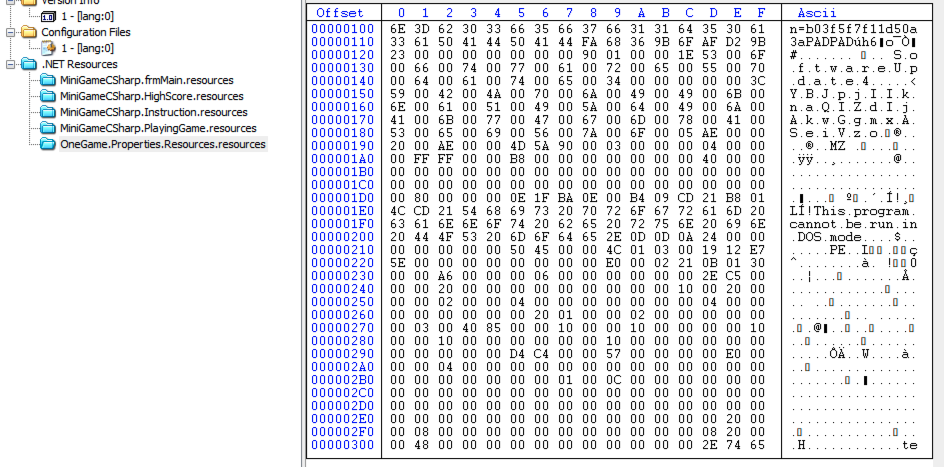

<br>

Boom we can see that the string "SofwareUpdate4" exists in OneGame.Properties.resources.resources. The code is calling this as a key value pair with the value here being the exe code packed underneath it. (MZ header is a dead giveaway).


Lets extract this stage2 exe and see if it will be parsed correctly.

The dropped SHA256 shows **0** hits on virustotal.
Dropped Exe in PeStudio

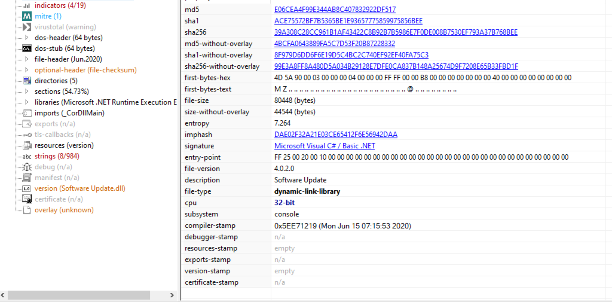

<br><br>

We can now open up this new stage2.exe which has the original name "Sofware Update.dll" in DnSpy and see that it has various methods such as "gitdownload" which are called from the original exe.

Original Exe Calling functions Like "GitDownload":


<br><br>

These methods are described in 2nd dropperd exe as we can see


<br><br>

## NOTE:
**I first decided to parse this statically but after a while i decided to just dump the executable from memory when it is decoded. To do this you can run the dnspy debugger and set it to show loaded modules. Once the module is loaded you can then dump from memory**

### **I left in some of the static analysis i was doing below but you can skip over this as its not necessary if you want to just dump from memory**

```text We know the method GitDownload is called from the original exe so lets step into this first.

We are passing the params, j4.p and "Onegame" to this. If we step into the method they are named as I2I and I1I.

They are passed into a series of functions:

byte[] rawAssembly = GitClone.I5I(GitClone.I3I(GitClone.I4I(I2I, I1I)));


We can see they are first passed into a method called GitClone.141.
byte[] rawAssembly = GitClone.I5I(GitClone.I3I(GitClone.I4I(I2I, I1I)));

Lets step into this:

It returns a bitmap object

The variables are renamed to mm(this is previously I2I and j4.p) and xx( this is previously I1I and "OneGame").

Lets follow xx first:
xx is passed to the as a param to create a new resource manager object. It references to the entry assembly. SO here we are returning the Onegame.Properties.resources resource manager.

Now lets see what mm is used for:

mm is passed to latebinnding.lateget to get a resource from the resource manager. It returns a bitmap. This is likely the second executable.

This bitmap is then returned.


Next we step into the second function: (Remember we are now passing a bitmap to this)
byte[] rawAssembly = GitClone.I5I(GitClone.I3I(GitClone.I4I(I2I, I1I)));

In Gitclone.I3I the bitmap is named aa:

aa is referenced three times in this function

num8 = aa.Width.  - 1;
Size size == aa.Size
Color pixel
pixel == aa.GetPixel(num9, num12)

Seems to return an array conaining a byte list of the pixel.r pixel.b pixel.g

It will keep doing this to decode an executable.

```


<br><br><br>

## Stage 3: FormBook

### **Once we have dumped the executable from memory, we now have a third stage executable known as *FormBook*. It was heavily obfuscated It is used to load another file called cryptobin.exe.**

### **FormBook has many different functions, some of which are explained below**

<br>

We can deobfuscate Formbook using **de4dot**. This makes the code a lot more readable.
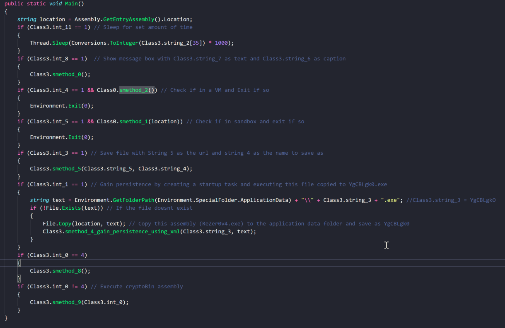

<br><br>

**Formbook Config String for this variant:**

The formbook config string is set by the attacker in the builder. It is used by the attacker to set flags which determine what the malware should do at runtime.


<br><br>

Formbook Config Explanation: 


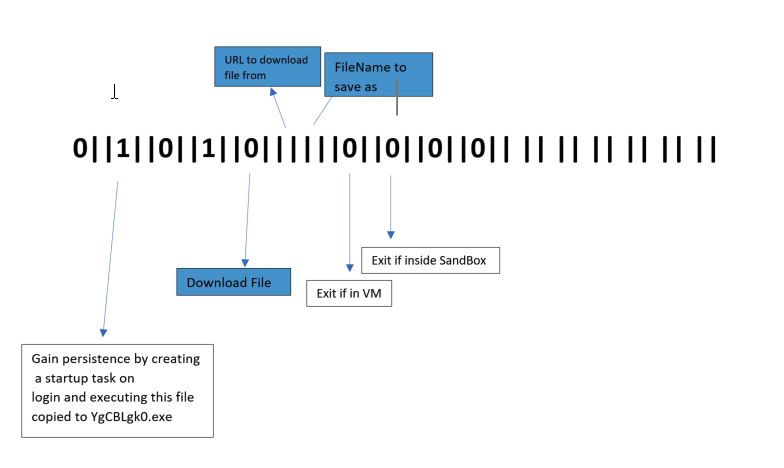

<br><br>


## Stepping through the Main Function of this Deobfuscated Formbook Variant

The first if statement checks if the config string's sleep flag is set to 1. If it is(It was in this case) then we sleep for a set amount of seconds.(30 in this case as per the value 35 in config string).


<br><br>

The next if statement checks if the messagebox flag in the config string is set. (It is not set in this variant so this will be skipped)


<br><br>

Next we have two if statements related to anti-vm techniques. This variant of FormBook's config string is set to not check if the malware is running in a VM or A sandbox. This means we do not have to patch the code to change this as these functions will be passed over.


<br><br>

Next, we have an if statement to see if the download flag is set. Formbok can be used as a downloader by passing the correct flag, url and file name to the config string. In this variant it is not set.


<br><br>

After this, we have an if statement for persistence. 

If the persistence flag is set in the config string. (It is in this case), we will first copy this executing assembly to another location. It will be saved as the new name "YgCBLgk0", and added as a startup task which i'll discuss next. 


The Malware use schtasks.exe to schedule a new task. The malware takes an xml configuration, which is stored in its resources, and starts a new schtasks.exe process, telling schtasks to update its tasks, with this xml configuration. 
With this task added and saved as the author name of the current user it will now:

    1. Execute this task on login.
    2. The command to execute is to run "YgCBLgk0.exe"


XML File: (We can see "[Location]" in the command section.  This will be replaced by the location of "YgCBLgk0.exe" and "[USERID]" replaced by the current user.

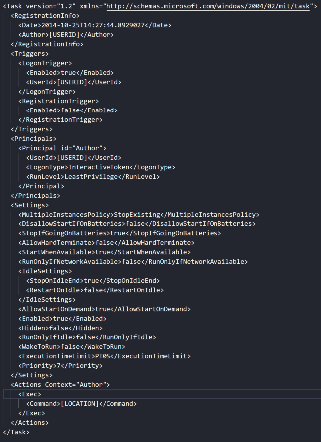

<br><br>

Next we have the file dropper method. This is used to decrypt and drop a file from resources. This is set to true in the config string and we will discuss this next.


<br><br>

The file dropper method uses more decryption to drop another executable. Again we can just:

 1. Run the dnspy debugger.
 2. Step into the method where this executable is decrypted.
 2. Find decrypted executable in memory.
 3. Dump it to a .bin file.


This is what the executable looks like in memory. (Look for MZ header)

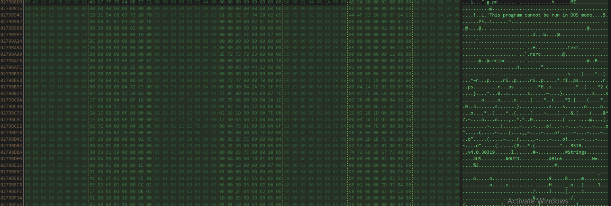

<br><br><br>

## Stage 4: Crypto Stealer dumped from FormBook memory.

This stage4 executable is named cryptobin.exe. It is a .NET executable.

It is used to check whenever a btc address is copied to the clipboard. It will then remove this and inject the attackers btc address here instead causing the user to send money to the wrong address.

It is configured to only steal Bitcoin as we can see below no other addresses are set.

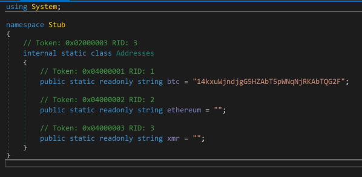

<br><br>

Some Dynamic Analysis:

When i execute the original OneGame payload and logout and log back in we can see that the task scheduled by schtasks.exe is executed and "YgCBLgkO.exe" runs on startup as predicted.


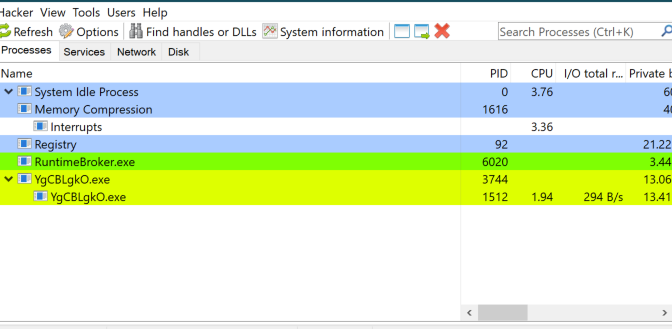

<br><br>


Below I tried to copy the address on top and then paste it below, we can see that cryptobin.exe successfully changed this to the attackers btc address.


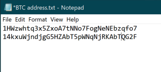

<br><br>


If we look up this Bitcoin address we can see it received/stole a total of *$125.04*.


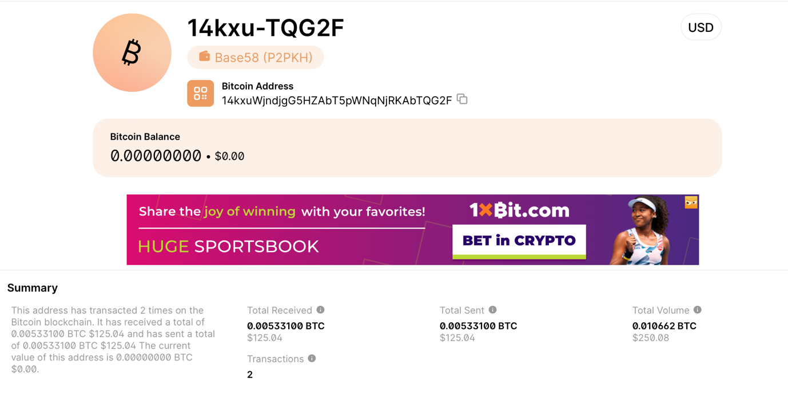

<br><br>


# Summary:

***Stage 1***: of this sample uses onegame.exe to load a dll named SoftwareUpdate4.dll from its resources.

***Stage 2***: uses this dll to drop Formbook(regxfsfs.exe).

***Stage 3***: uses FormBook to drop a file named cryptobin.exe.

***Stage 4***: "cryptobin.exe" is a cryptocurrency clipper. It will modify your clipboard to paste the attackers btc address so that you accidentally sent bitcoin to the attackers address instead of your own.

<br>

## **Execution Flow of the Analysed Sample:**

*OneGame.exe ---> Software Update4.dll ---> regxfsfs.exe ---> cryptobin.exe*


