# Cylance Ransomware

SHA-256: ec8952dc14bac73174cef02a489539e244b378b7de76c771126a8ba7ce532efd

File Type: 32-bit Windows Executable

This sample is a ransomware known as **Cylance Ransomware**, below we will step into the main function and investigate how it works

<br><br><br>

## Main Function:


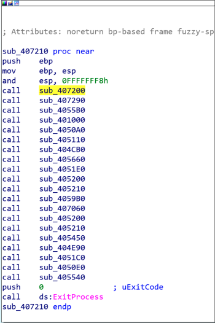


<br><br><br><br>

## Sub_407200

 This function gets console window and sets show window with parameter of 0 indicating it should not be displayed 


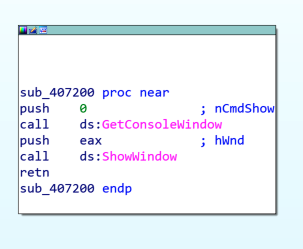

<br><br><br><br>

## sub_407290 

Create Heap / Get Handle to existing Heap


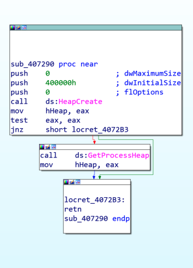

<br><br><br><br>

## sub_4055B0 

This function is used to set multiple privileges for the currently running process

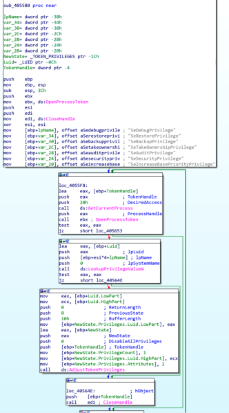

-	"SeDebugPrivilege": Allows the process to debug other processes and access their memory.
-	"SeRestorePrivilege": Allows the process to bypass file and directory permission checks and restore backed-up files and directories.
-	"SeBackupPrivilege": Allows the process to read files and directories with the "backup" privilege, bypassing normal permission checks.
-	"SeTakeOwnershipPrivilege": Allows the process to take ownership of any securable object in the system, including files, directories, and registry keys.
-	"SeAuditPrivilege": Allows the process to generate security audits, which are records of system events such as logons, logoffs, and resource accesses.
-	"SeSecurityPrivilege": Allows the process to modify the security settings of objects in the system, including changing permissions and auditing settings.
-	"SeIncreaseBasePriorityPrivilege": Allows the process to increase its base priority level, which affects its scheduling priority and the amount of CPU time it receives.


If we go to process hacker after running this function we can see the privileges listed above have been successfully set:

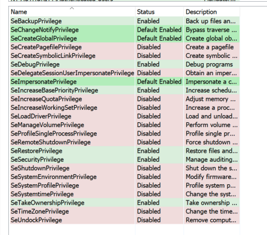

<br><br><br><br>

## sub_40100

The next function “sub_40100” is the function used to check the configurations,

Configurations can be set for this ransomware by the attacker through the command line.

 If a configuration is met this function stores the value 1 for the corresponding dword in the heap which is read later. Else it sets it as 0 to indicate it should not use that configuration.

For example we can see the code below checks for the “restart” parameter. If set it will move the value 1 to the dword which corresponds to the restart parameter. We will rename these dwords to their corresponding values to make analysis easier later.


<br><br>

Here’s another config example, there are multiple types of encryption that Cylance ransomware can do. 

We can from the strings below that they are “full”, “fast”, “split” and “custom”.

We are comparing the command line argument located within the edi register with each of these.
We are then moving either the value 1, 2, 3 or 4 in the the mode flag based on the result of this comparison.

If a user chose “fast” encryption mode, then the value 2 would be moved into the modeFlag, later on when the ransomware is performing encryption it will come back and check this modeFlag and know to perform fast encryption.

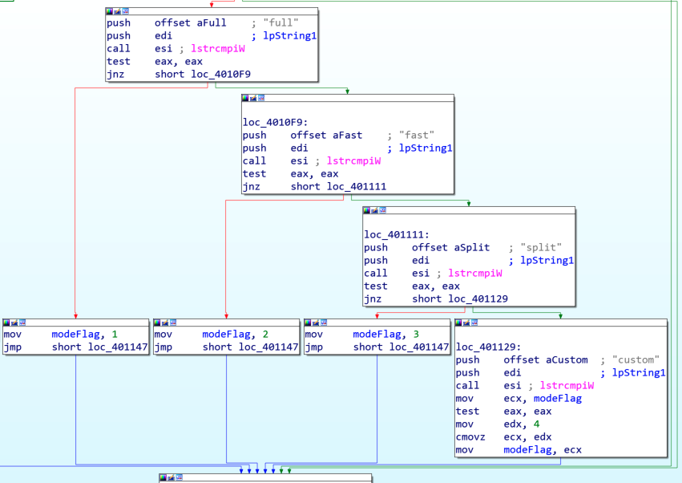


CONFIGURATIONS:

- **-path** : provide directory path to encrypt

- **-mode**:
	-	full: encrypt all files completely
	-	fast: only encrypt first few bytes of file
	-	split: encrypt files from an offset
	-	custom: custom encryption from an range

<br>

- **-priority**: Sets priority level of the malware

- **-skip**: how much bytes to skip to when encrypting

- **-power**: can be used to shutdown or restart system, does this with the help of a dropped file

- -**console**: display what the ransomware is doing in console

- **-nomutex**: don’t create a mutex

- **-nonetdrive**: don’t encrypt network shares

- **-nodel**: “no delete” Ransomware is deleted by default. This flag doesnt delete ransomware after execution


<br><br><br><br>


## sub_4050A0
The next function  simply creates mutex named “CylanceMutex”. It first checks the noMutexFlag which is one of the command line configs:


<br><br><br><br>

## sub_405110 

This function establishes **persistence** by scheduling the current running executable as a startup task: 

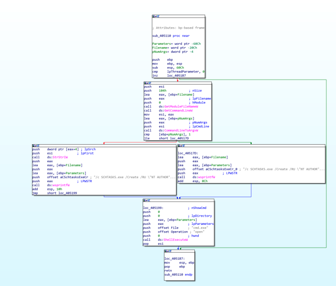


**Command**:
```
"C:\Windows\System32\cmd.exe" /c SCHTASKS.exe /Create /RU "NT AUTHORITY\SYSTEM" /sc onstart /TN "Windows Update BETA" /TR "ec8952dc14bac73174cef02a489539e244b378b7de76c771126a8ba7ce532efd.exe" /F
```
It sets the startup task to run under the name **“Windows Update Beta”**.

<br><br><br><br>

## sub_404CB0

The next function created and writes to a file named MSVC150.dll in the current directory. It writes the value “=================\r\n” to the file. This file is later used as a logging file for the malware.


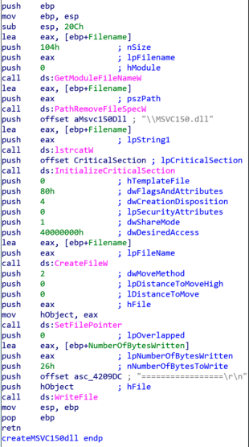

<br><br><br><br>

## sub_405660

This function is simply used to build the ransom note. We can see it passes the email address to the default Cylance Ransomware note.


## sub_405200

The next function is only used to empty recycling bin: 

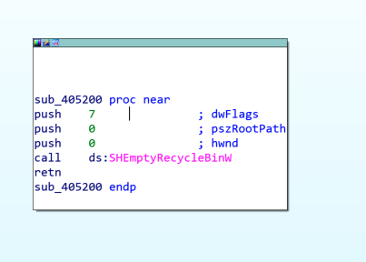


## sub_405210
This function sub_405210 is used to delete all shadow copies. This ensures there is no backups which can be recovered after the attack. We rename to deletesShadows.


## Enumerate Drives

The next function is used to discover drives on system, we rename to discoverDrives. the output of these is printed to the previous file logging file "mscv150.dll".

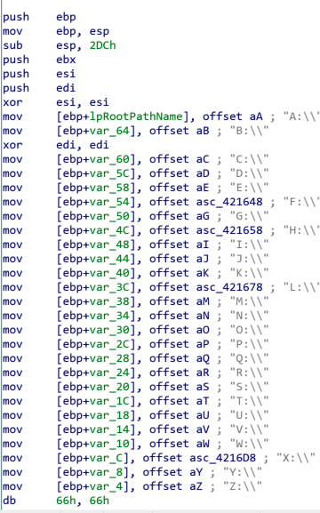


## sub_407060

The next function “sub_407060” is the main encryption function, we wills step over this for now and come back later.
Renaming to mainEncryption.


<br><br><br>


### sub_405450
This function drops a exe file named LPW5.tmp.

**Sha-256: A6C41F368F42A7C57C307A48CE2440A60A744226B6414FADB6517A80A5D160A2**

The contents look like a wiper so I skipped the instruction to run it for now, however i believe it is used by the power config to decide whether to shutdown/ restart the system
Renamed to “dropPotentialWiper”


<br><br><br><br>

## Overview
<br>

With all this combined we now have an overview of the program,
We can clearly see the below the general route this malware takes when encrypting the users system.


# Investigating The Encryption Function


The first thing it does is create a file named “Cylance_README.txt” in the C directory.

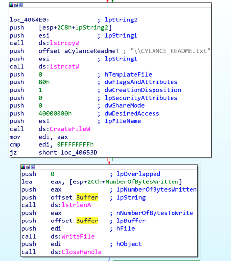


We can see above once the file is created a buffer is written to the file. To see what this is owe can use x32dbg and check the dump in memory.

**Contents of Buffer:**


We can see below that a ransom note is being written to the file:


If we click “show x refs” to the buffer in ida we can see that it is passed to the function “sub_404EF0”, we can assume that this function takes both email addresses and inserts them into the default cylance generic ransom note. I assume this allows people to specify their own email addresses in the builder.


Files are then enumerated and once potential file is found we step into another ransom function. We can see it is using AES encryption in CBC mode.


Mode flag being used


We can see above that the mode flag is now being used. The program uses a switch statement to determine what it should do based on the modeflags value. The options are 
 - Full
 - Fast
 - Split
 - Custom
 - Default

Once this is decided the contents of the file will be encrypted under the process defined by the chosen mode. The encrypted files are appended a **".cylance"** extension.

<br><br><br><br>

# Dynamic Analysis:

I decided to execute this ransomware using the **-path** and **-config** parameters. This allows me to only encrypt a test directory by passing its path with the path parameter and it also allows me to see the console output.

Once executed we can see that the file below is instantly encrypted and there has also been a ransom note dropped to the directory:

Encrypted Directory:


Cylance Ransom Note:


We can also see the output from the console below stating that one file has been encrypted:


