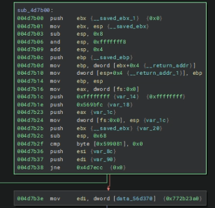
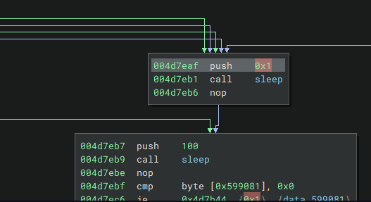
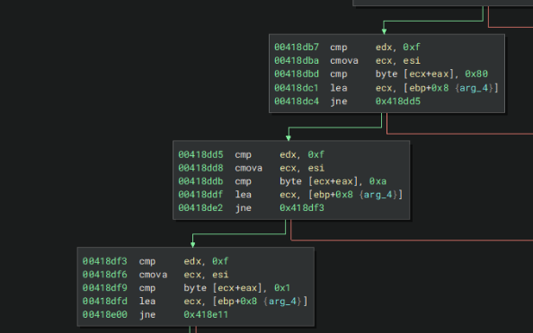
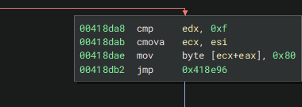
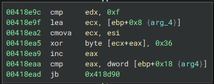
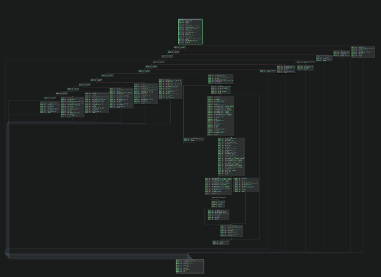

# RisePro Malware Analysis
SHA-256: **174b0542f7ec81deaa7cee471a9194512e04a67b5294f651d9cdf6035648d23a**
File Type: 32-bit Windows Executable

## Description:
RisePro is a malware sample that functions as both an info-stealer and a dropper for additional payloads.

## Unpacking
RisePro uses a packer not identified by tools like unpack.me or Detect It Easy, prompting manual unpacking via a debugger. 
The sample appears to be packed with Themida, which employs numerous anti-debugging techniques. 
After bypassing these checks, shellcode was written to memory address 00411000, which was then dumped and analyzed using Binary Ninja. Since Themida is a commercial packer used in legitimate applications, this unpacking method will not be described in detail in this report.

## C2 Communication Function
The main C2 communication function contained references to DLLs that were not attached to the dumped shellcode.
By statically comparing the memory addresses of these functions to the import address table of the running process, functions such as the WinAPI Sleep function (0x77223a0b) were identified and renamed in the dumped shellcode.

The primary purpose of this function is to connect to a C2 server at 127[.]45[.]47[.]126 on port 58709. By redirecting this IP address to 127.0.0.1, C2 requests were rerouted to a local machine. 
A Python socket server was then set up to interact with the malware, allowing observation of its behavior in response to different dynamic conditions.

The binary attempts to connect to the C2 server continously with a sleep call of 1 millisecond followed by a sleep call of 100 milliseconds between each connection attempt.

## C2 Encryption/Decryption Function
Upon calling the recv function to receive data from the socket, the first 8 bytes are checked to match the hex string ADDABAAB, serving as a validation check. The subsequent decryption function uses a substitution table and XOR to decrypt the received data.

Below we can see that various values are compared to the byte at [ecx+eax], after each loop of this function eax is incremented which allows the binary to loop through each byte in the encrypted data.

If a byte is equal to a certain value it will be subsitituted, for example if a byte is equal to 0x00 a jump will be taken to code which replaces this byte with 0x80.

At the end of each loop an xor of the byte with the value 0x36 is undertaken using the xor instruction, we can also see that after this the eax register is incremented to point to the next byte when added to ecx.

Through this analysis it was discovered that RisePro is using the same subsitition values described two years ago in a post by sekoia https://blog.sekoia.io/new-risepro-stealer-distributed-by-the-prominent-privateloader/

## Check Command Function
Once data is decrypted, the checkCommand function is invoked to verify the command sent in the response data. This sample included additional commands, such as 0x2731, which were not fully analyzed at this time as they were not utilized.
Various different command options are possible including loading additional payloads.

