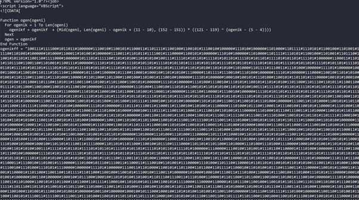
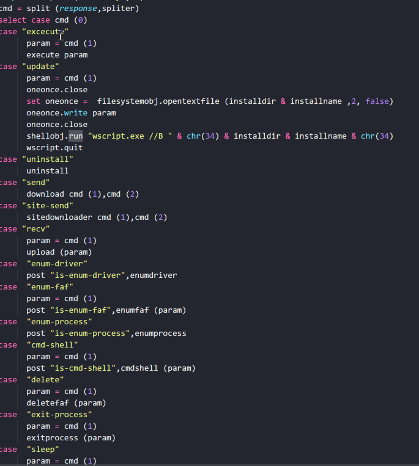

# Houdini Dropper Analysis

## Stage 1: Decoding the Obfuscated VBScript

We are presented with a VBScript file with lots of obfuscation.

We can decode this by defanging the executution part of the code and instead just printing it to the console.

     

## Stage 2: Analyzing the Decoded VBScript

Now that we have printed the decoded VBScript to the console, we can save it to a file called stage2.vbs and analyze it further.

  

### **Houdini RAT Configuration**

The stage2.vbs file contains a comment indicating that it is Houdini. We can use OSINT to quickly find out that this is a VBS based Remote Access Trojan (RAT). The RAT's configuration specifies the following:

Host to reach out to: **localhost**

Port: **82**

Install directory: **Temp Folder**

  

### **Investigating How the Houdini RAT Works**

The RAT uses a post function to send malware to the C2 located at the set host and port in the config file, which in this case will only be our localhost. It then returns the HTTP response from this post request.

We have a lot of different response cases, such as the execute case. This will take the first command "execute " and the second parameter is what it should execute. This could be used to drop further malware and to execute malicious commands on the victim's machine.

  

### **Gaining Persistence**

The RAT achieves persistence by modifying the run key in the registry.

  

### **Communication with Houdini RAT**

We can set up our own C2 using Python to communicate with the RAT. From the screenshot below, we see that the RAT sends information about the victim's PC, such as the device type and which antivirus software is installed (in this case, just Windows Defender). It then waits for a command response and will execute based on this.

  

# Summary

**This RAT uses an obfuscated VBScript to drop Houdini Rat. Once on the victims computer it establishes persistence by adding itself the the run registry key and communicates user's pc information back to its host. The host can issue commands which can do a variety of things such as downloading more malware, establishing a shell etc.**
